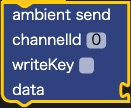
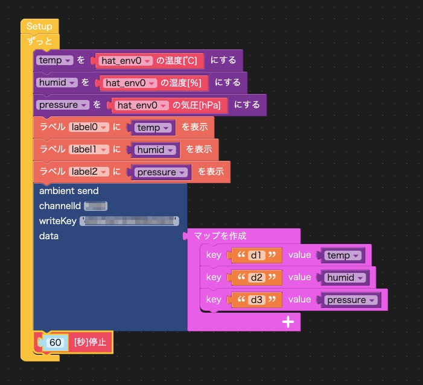

# UIFlow Block for Ambient

Ambientにデータを送るUIFlowブロックです。

* [src/ambient.m5b](./src/ambient.m5b) : Ambientブロック
* [examples/ENV.m5f](./examples/ENV.m5f) : ENV Hatで温度、湿度、気圧を取得するサンプル
* [examples/ENV2Ambient.m5f](./examples/ENV2Ambient.m5f) : ENV Hatで温度、湿度、気圧を取得し、Ambientに送るサンプル

このように使います。

詳しくは[UIFlow（Blockly）でAmbientにデータを送る]()をご覧ください。
